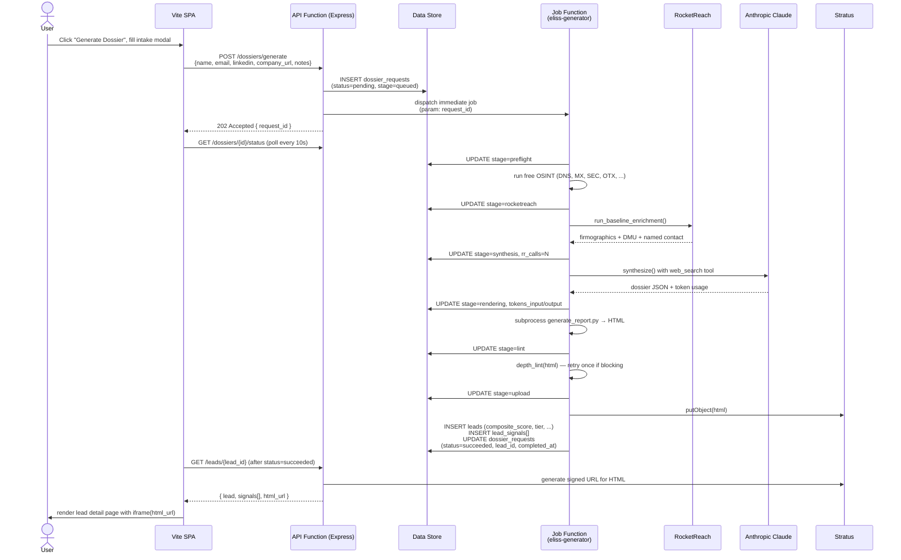

# 01 — System Overview

A five-minute orientation. Read this before any other architecture doc.

## What the system does

A sales rep enters a prospect's name, email, LinkedIn URL, or company URL. Within ~5-10 minutes, the application returns a scored ELISS dossier — a 2-tab HTML report with a 0-100 composite score (Fit / Intent / Timing / Budget), competitive threat matrix, decision-making unit map, compliance pressure heatmap, demo playbook, and 3 recommended outreach emails.

Two generator variants ship today:

- **Light** (~2-4 min, single Anthropic call) — default path, used for most leads.
- **Heavy** (~8-13 min, 4 parallel Anthropic subagents + parent consolidation) — gated behind a 5-tap UI escape hatch; produces a higher-density dossier for HOT-suspected prospects.

## Project identity

| Field | Value |
| --- | --- |
| Catalyst Project Name | `lead-insight-hub` |
| Project ID | `31210000000133001` |
| ZAID | `50042133518` |
| Org / Env ID (dev) | `60066539659` |
| Env ID (prod) | `50042142947` |
| Data Center | IN |
| Public dev URL | https://lead-insight-hub-60066539659.development.catalystserverless.in |
| Local working dir | `C:\Users\dGiri\Desktop\LABS\ELISS FRAMEWORK\lead-insight-hub-catalyst` |
| Database mode | SINGLE_DB |
| Timezone | Asia/Kolkata |

Source: `catalyst.json` and the Catalyst project metadata (read via MCP).

## Three-tier stack

```
┌──────────────────────────────────────────────────────────────────────┐
│  Browser (Chrome, Safari, Firefox)                                   │
│  └─ Vite SPA — React 19 + TypeScript + TanStack Router + shadcn/ui   │
│     served by Catalyst Web Client Hosting (client.source = app/dist) │
└────────────────────────────────────┬─────────────────────────────────┘
                                     │ /server/api/*  (proxied in dev)
                                     │ /api/*         (in prod)
┌────────────────────────────────────▼─────────────────────────────────┐
│  API Function — Advanced I/O, Node 18, Express                       │
│  functions/api/index.js                                              │
│   ├─ /auth/signup     (public)                                       │
│   ├─ /auth, /me       (Catalyst-authed)                              │
│   ├─ /leads           (CRUD + CSV upload)                            │
│   ├─ /dossiers        (POST = create; GET = poll)                    │
│   ├─ /stats           (usage analytics)                              │
│   └─ /admin           (App Administrator only)                       │
└──────┬────────────────────┬────────────────────┬─────────────────────┘
       │                    │                    │
       │ ZCQL               │ Stratus            │ Job dispatch
       │ (data-store SDK)   │ (signed URL)       │ (immediate job)
       │                    │                    │
┌──────▼──────┐      ┌──────▼──────┐      ┌──────▼─────────────────────┐
│ Data Store  │      │ Stratus     │      │ Job Function (Python 3.9)  │
│ 4 tables    │      │ `dossiers`  │      │ elissgenpool — 1536 MB     │
│             │      │ bucket      │      │   • eliss-generator        │
│ leads       │      │             │      │   • eliss-heavy-generator  │
│ lead_signals│      │ HTML files  │      │                            │
│ user_roles  │      │ ELISS_*.html│      │ calls out to ↓             │
│ dossier_    │      │             │      └──┬─────────┬─────────┬─────┘
│   requests  │      │             │         │         │         │
└─────────────┘      └─────────────┘         │         │         │
                                             ▼         ▼         ▼
                                        ┌────────┐ ┌──────┐ ┌────────┐
                                        │Anthropic│ │RR API│ │AlienVlt│
                                        │Claude   │ │      │ │  OTX   │
                                        │Sonnet 4.6│ │/v2/* │ │        │
                                        └────────┘ └──────┘ └────────┘
```

## Happy-path: "Generate Dossier"



The poller's status badge maps to UI states: `pending|queued|preflight|rocketreach|synthesis|fanout|rendering|lint|upload|done|error`. See [04-eliss-generator-light.md](./04-eliss-generator-light.md) for the stage state machine.

## Two environments

Both ship the same code; they differ in env-var values, user pool, and URL.

- **Development** (env `60066539659`, default working environment): URL above. Used by the team for daily iteration. Has the App Administrator account `iaminzoho@gmail.com` and 4 App Users including `dwaipayan.g@zohotest.com`.
- **Production** (env `50042142947`): default-active for the project; not yet hosting customer traffic at the time of this v1.0.0 baseline. Promote releases via the deployment runbook.

The `catalyst.json` is environment-agnostic — env selection is via `--org <envId>` on the CLI. See [08-catalyst-deployment.md](./08-catalyst-deployment.md).

## Where each piece lives

| Layer | Local path | Catalyst component |
| --- | --- | --- |
| Frontend SPA | `app/src/*`, build output in `app/dist/` | Web Client Hosting |
| API function | `functions/api/` | Advanced I/O Function |
| Light generator | `functions/eliss-generator/` | Job Function (job pool: `elissgenpool`) |
| Heavy generator | `functions/eliss-heavy-generator/` | Job Function (same pool) |
| Tables | (defined in console) | Data Store: `leads`, `lead_signals`, `user_roles`, `dossier_requests` |
| HTML storage | `bucket: dossiers` | Stratus |
| Env vars | `catalyst-config.json` (gitignored) | per-function config |

## Cross-references

- Data model and bigint discipline → [06-data-model.md](./06-data-model.md)
- Deployment commands and env-var rules → [08-catalyst-deployment.md](./08-catalyst-deployment.md)
- How the `/eliss` skill maps to this implementation → [09-eliss-skill-explained.md](./09-eliss-skill-explained.md)
- Security boundaries and RBAC → [10-security-and-rbac.md](./10-security-and-rbac.md)
