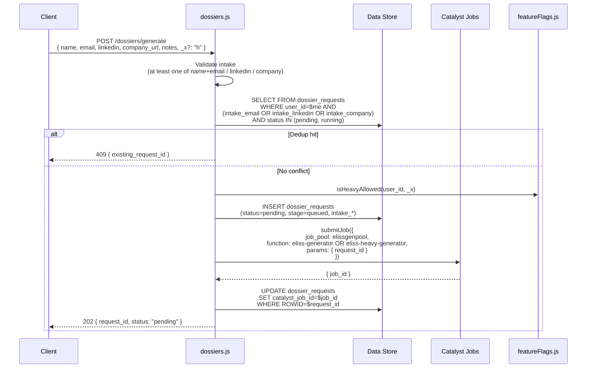

# 03 — API Function (Express)

The single Advanced I/O Function that serves every server-side request from the SPA. Node 18, Express.

## Entry point

`functions/api/index.js`:

```javascript
const express = require("express");
const { attachCatalyst, requireUser, loadRole, requireAdmin } =
    require("./lib/auth");

const app = express();
app.use(express.json({ limit: "6mb" }));
app.use(express.urlencoded({ extended: true, limit: "6mb" }));

app.use(attachCatalyst);

const BUILD_ID = "2026-05-21-self-signup";
app.get("/health", (req, res) =>
    res.json({ ok: true, ts: new Date().toISOString(), build: BUILD_ID }));

// PUBLIC routes — mounted BEFORE requireUser
app.use("/auth/signup", require("./routes/signup"));

// All other routes require an authenticated Catalyst user
app.use(requireUser);
app.use(loadRole);

app.use("/auth",     require("./routes/auth"));
app.use("/me",       require("./routes/me"));
app.use("/leads",    require("./routes/leads"));
app.use("/dossiers", require("./routes/dossiers"));
app.use("/stats",    require("./routes/stats"));

// Admin-only routes
app.use("/admin",
    (req, res, next) => requireAdmin(req, res, next),
    require("./routes/admin"));

app.use((err, req, res, next) => {
    console.error("unhandled:", err);
    res.status(500).json({ error: err?.message || "internal error" });
});

module.exports = app;
```

Three things to note:

1. **Express app exported directly** — Catalyst's Advanced I/O Function loader detects an `app.use`-shaped object and bridges it to the underlying HTTP server.
2. **`BUILD_ID` is the deploy heartbeat.** Bumped manually on each deploy; surfaced at `GET /health`. Use it to verify the function image actually updated. See [08-catalyst-deployment.md](./08-catalyst-deployment.md).
3. **Route mounting order matters.** `/auth/signup` must mount before `requireUser` — otherwise nobody could sign up because they'd need to be signed in first. The "App Administrator" auth check is *also* layered on top of `requireUser` for `/admin` routes.

## Middleware chain

```
Request
  │
  ▼
attachCatalyst       → puts a fresh zcatalyst_sdk instance on req.catalystApp
  │
  ▼
(public routes — /auth/signup — exit here)
  │
  ▼
requireUser          → reads Catalyst session cookie; 401 if absent
  │
  ▼
loadRole             → SELECT FROM user_roles WHERE user_id; auto-creates row
  │                    if missing; updates last_seen_at (60s throttled)
  ▼
(authenticated routes — /me /leads /dossiers /stats)
  │
  ▼
(admin routes only)  requireAdmin → 403 unless req.userRole === 'admin'
  │
  ▼
route handler
```

The chain is defined in `functions/api/lib/auth.js`. Each middleware sets a property on `req`:
- `req.catalystApp` — initialized SDK instance (per-request, never reused).
- `req.user` — Catalyst user object (`{ user_id, email, first_name, last_name, ... }`).
- `req.userRole` — `'admin'` or `'user'`, sourced from the `user_roles` table.

## Route files

All under `functions/api/routes/`:

| File | Mount path | Endpoints |
| --- | --- | --- |
| `signup.js` | `/auth/signup` | `POST /` — self-service signup (public) |
| `auth.js` | `/auth` | session-lifecycle helpers (logout, refresh) |
| `me.js` | `/me` | `GET /` — current user profile + role + last_seen_at |
| `leads.js` | `/leads` | `GET /`, `GET /:id`, `POST /upload`, `DELETE /:id` |
| `dossiers.js` | `/dossiers` | `POST /generate`, `GET /active`, `GET /:id/status`, `POST /:id/cancel` |
| `stats.js` | `/stats` | `GET /` — counters + recent activity |
| `admin.js` | `/admin` | `GET /users`, `POST /users/:id/role`, `DELETE /users/:id` |

### `dossiers.js` — the orchestrator

The most complex route file. Sequence on `POST /generate`:



The dedup check is the most surprising part — submitting twice with the same email/LinkedIn/company URL while the first job is in flight returns the existing `request_id` instead of starting a second job. The polling UI handles this transparently.

## `lib/` helpers

`functions/api/lib/` has seven files. Each is small enough to read end-to-end.

### `auth.js`
Exports `attachCatalyst`, `requireUser`, `loadRole`, `requireAdmin`. `loadRole` carries the App Administrator vs `user_roles.role` disambiguation discussed in [10-security-and-rbac.md](./10-security-and-rbac.md).

### `db.js`
ZCQL helper with the **300-row pagination** baked in. The single function `fetchAll(zcql, baseQuery, table)` keeps issuing `${baseQuery} LIMIT $offset, 300` until a partial page returns. Use this anywhere you might exceed 300 rows. Also provides `select_one`, `select_count`, `catalyst_datetime` (timestamps formatted for ZCQL).

### `stratus.js`
Catalyst Stratus client wrapper. Two functions:
- `putHtml(app, key, html)` — uploads a string as text/html with no versioning. Stratus rejects `putObject` on an existing key (versioning is disabled), so callers must use a unique key per write.
- `signUrl(app, key, ttlSeconds)` — generates a time-limited pre-signed GET URL for the iframe.

### `parser.js`
Used by the CSV/HTML upload path. Parses uploaded dossier HTML and extracts the scoring fields back into `leads` and `lead_signals` rows. The complement to `eliss-generator/lib/store_lead.py` for non-generator inputs.

### `storeDossier.js`
Used by `POST /leads/upload`. Wraps `parser.js` + `stratus.putHtml` + the multi-row insert into a single transaction-like operation. Same logical responsibility as `store_lead.py` on the generator side, just for human-uploaded inputs.

### `featureFlags.js`
Exports `isHeavyAllowed(userId, hint)`. The current implementation allows heavy mode for any user when `hint === "h"`. The function is a single point of change — if heavy mode ever needs to be allowlist-restricted (e.g., a subset of users during beta), this is where the per-user check goes.

### `mailer.js`
Sends the Catalyst confirmation email on signup. Uses Catalyst Mail (no SMTP setup needed). Templates live inline; if the team grows them, extract to `functions/api/templates/`.

## Request and response shapes

For the contracts of every route, the source of truth is each `routes/*.js` file. Two shapes worth knowing here:

### `POST /dossiers/generate` — request

```json
{
  "lead_name": "Perry Amo-Mensah",
  "email": "pmensah@burlingtonnc.gov",
  "linkedin_url": "https://linkedin.com/in/pamomens/",
  "company_url": "https://burlingtonnc.gov",
  "notes": "warm intro from Mayor's office",
  "_x": "h"
}
```

`_x` is optional; presence + value `"h"` means "request heavy mode." The server may downgrade if `isHeavyAllowed` returns false.

### `GET /dossiers/:id/status` — response

```json
{
  "request_id": "31210000000200099",
  "status": "running",
  "stage": "synthesis",
  "started_at": "2026-05-22T11:14:03Z",
  "completed_at": null,
  "tokens_input": 0,
  "tokens_output": 0,
  "rr_calls": 22,
  "rr_degraded": false,
  "lead_id": null,
  "error_message": null
}
```

When the job completes, `status` becomes `succeeded` (or `partial` / `failed`), `lead_id` is populated, and the client can `GET /leads/:lead_id` to render the dossier.

## Error model

Errors leave the function as JSON with a HTTP status code:

| Status | Meaning | Example |
| --- | --- | --- |
| 400 | Bad input — validation failed | `{"error":"linkedin_url is malformed"}` |
| 401 | No authenticated Catalyst user | `{"error":"unauthenticated"}` |
| 403 | Authenticated but lacks role | `{"error":"admin required"}` |
| 404 | Resource not found | `{"error":"lead not found"}` |
| 409 | Dedup conflict | `{"existing_request_id":"..."}` |
| 500 | Unhandled — top-level catch | `{"error":"internal error"}` |

The error middleware at the bottom of `index.js` is the last-resort 500; routes should never reach it in normal operation.

## Health and debugging

- **`GET /health`** — open; returns `{ ok, ts, build }`. Use to verify a deploy.
- **Function logs** — Catalyst Console → Functions → `api` → Logs tab. Look for `unhandled:` lines, which indicate a route handler that didn't `try/catch`.
- **Per-request tracing** — APM is not enabled. If a route is slow, add `console.time` instrumentation and redeploy with `--only functions:api`.

## Cross-references

- The Job Function that fulfills `POST /dossiers/generate` → [04-eliss-generator-light.md](./04-eliss-generator-light.md)
- Data Store schemas the routes touch → [06-data-model.md](./06-data-model.md)
- Frontend that consumes these endpoints → [02-frontend-vite-react.md](./02-frontend-vite-react.md)
- RBAC details for the `requireAdmin` chain → [10-security-and-rbac.md](./10-security-and-rbac.md)
