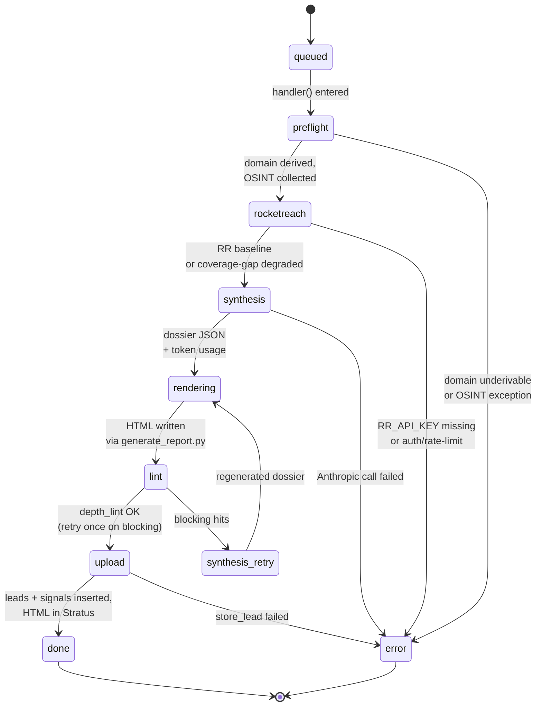

# 04 — ELISS Generator (Light)

The default dossier-generation pipeline. Python 3.9 Job Function under the `elissgenpool` Job Pool. Source-of-truth: `functions/eliss-generator/main.py`.

## Function contract

- **Type:** Job Function (Catalyst dispatches it via `submitJob`).
- **Runtime:** `python_3_9`.
- **Memory:** 512 MB declared (capped at pool ceiling).
- **Timeout:** 900 s (15 min hard cap).
- **Handler signature:** `def handler(job_request, context):`
- **Job param expected:** `request_id` (a `dossier_requests.ROWID` as string).
- **Terminal calls:** `context.close_with_success()` or `context.close_with_failure()` (in `finally`-like flow at the top level).

## The 7-stage pipeline



Each transition writes the new `stage` (and any new metrics) to the `dossier_requests` row via `_patch_request()`. The frontend poller observes these in real time.

## Stage detail

### 1. `queued` → `preflight`

`handler()` initialises `zcatalyst_sdk`, then `_run_pipeline()` patches the row to `status=running, stage=preflight, started_at=<now>`.

### 2. `preflight`

Derives the prospect domain (email-domain > company-URL host > 400 if neither). Then `preflight.run_preflight(domain, ..., lead_email=...)` runs the vendored skill script. This hits up to 11 free public endpoints in parallel — no API keys required, no Claude tool budget consumed:

- DNS / MX (via Python `dnspython`)
- `crt.sh` for cert-transparency logs
- Microsoft tenant resolver (`getuserrealm.srf`)
- Web Archive (Wayback Machine)
- SEC EDGAR (for public companies)
- USAspending.gov (federal contracts)
- ransomware.live (recent victim catalog)
- GitHub org search
- HaveIBeenPwned domain probe (gated on `HIBP_API_KEY`)
- AlienVault OTX (gated on `OTX_API_KEY`)
- XposedOrNot (free public endpoints, always on)

Each probe returns up to ~10 KB of structured findings. The composite payload is merged into the dossier as `data_quality.sources_actually_checked[]`.

**Hard failures here** (e.g., the skill script crashed) write `status=failed, error_message=<reason>` and raise `_BlockingError`. The top-level `handler()` catches and calls `context.close_with_failure()`.

### 3. `rocketreach`

`RR_API_KEY` **is required** — if missing, the function patches `status=failed, error_message="RR_API_KEY not set"` and exits. There is no OSINT-only fallback for "no key at all"; that path is reserved for the coverage-gap case where the key works but RR has no firmographics for the org.

The `RocketReachClient().run_baseline_enrichment(...)` call executes 5 inner steps:

1. `account()` — free health check.
2. `lookup_company(domain)` — firmographics (employees, revenue, address, NAICS/SIC, techstack ≤90 items).
3. `person_search(company_id, management_levels=['Manager','Director','VP','C-Suite'])` — enumerate exec DMU teasers.
4. `bulk_lookup(top N exec IDs, N=10)` — full profiles with verified emails, phones, job history.
5. `profile_company_lookup(contact)` — only if intake had a name/email/LinkedIn.

Expected spend per dossier: ~12 `person_export` + 1 `company_export` + 1 `person_search`. The exact count lands in `dossier_requests.rr_calls`.

**Coverage-gap handling.** If `lookup_company` returns no data (typical for `.gov`, `.edu`, smaller nonprofits), the client swallows the 404 into `rr_baseline['errors']` and proceeds. The pipeline detects this via:

```python
has_company = bool(rr_baseline and rr_baseline.get("company"))
has_named_contact = bool(rr_baseline and rr_baseline.get("named_contact"))
has_exec_dmu = bool(rr_baseline and rr_baseline.get("exec_dmu_enriched"))
```

When `has_company` is false, `rr_degraded=True` is set on the row with `rr_degradation_reason=rr_full_miss` (nothing at all) or `rr_company_miss` (have people but no firmographics). The synthesis stage receives a flag and the UI surfaces an OSINT-only banner.

### 4. `synthesis`

`lib/synth.py` calls Anthropic Claude (Sonnet 4.6 by default, configurable via `ANTHROPIC_MODEL`). The prompt is built from `lib/skill_prompt.py` plus the preflight JSON and RR baseline. Claude is given the `web_search` tool with a 4-use cap.

Returns `(dossier_dict, usage)` where:
- `dossier_dict` is the full ELISS JSON schema (lead, company, scoring, technology, compliance, signals, recommendations, full_dossier_markdown, sources, data_quality, ...).
- `usage` carries `input` and `output` token counts.

The token counts are patched onto the request row before rendering — this way a synthesis crash still leaves observability fields populated.

### 5. `rendering`

The vendored `skill/scripts/generate_report.py` produces the HTML. **It is invoked as a subprocess**, not imported, because the script's `main()` ends in `sys.exit()` and reads `sys.argv` via argparse — both are awkward to monkey-patch from a long-running Job Function.

```python
subprocess.run([
    sys.executable, str(script), str(json_path),
    "--output-dir", str(tmp),
    "--format", "html",        # HTML-only, never PDF
    "--cleanup-input-json",    # deletes the JSON after rendering
], timeout=120)
```

The output is `ELISS_<company>_<lead>_<date>.html` in the OS temp dir. If `rr_degraded` was set, an OSINT-only banner is injected into the rendered HTML via inline-style `<div>` before the closing `<body>` (the markdown-callout pipeline already ran inside the subprocess).

### 6. `lint`

`lib/depth_lint.py` scans the rendered HTML for **empty-state literals**, split into two severity classes (not density thresholds):

- **HARD** — section-level failures: `No executive brief`, `No applicable frameworks`, `No sources cited`. A HARD hit on a **HOT/WARM** lead is **blocking**. `No sources cited` is in `_ALWAYS_BLOCKING`, so it blocks at **any** tier (a zero-citation dossier is unshippable regardless of lead value).
- **SOFT** — isolated empty cells: an `Unknown` field value, an em-dash heatmap cell, a `None detected` pill, an empty budget waterfall. These mean a specific value couldn't be resolved, not that a section is missing.

Two things changed in v1.1.0:

- **Source backfill (in `generate_report.py`, before lint runs).** When the structured `sources` array is empty, the renderer salvages cited URLs from the narrative — so the Source Quality donut populates and `No sources cited` only survives when the dossier truly cites zero URLs.
- **Tier-aware soft tolerance.** SOFT hits no longer force `partial` one-for-one. HOT/WARM stay strict (tolerance 0); COLD/COOL tolerate up to `light_lint_soft_tolerance` empty cells (super-admin setting, default **4**) before the dossier is marked `partial`.

If `lint_result["blocking"]` is true, the pipeline retries synthesis ONCE — patching `stage=synthesis_retry` so the UI can label this second pass differently. Token usage from the second attempt is added to the row.

A second blocking failure does **not** trigger another retry. The terminal status is then:

```python
is_partial = (lint_result["hard_total"] > 0          # any HARD hit survived
              or rr_degraded                           # OSINT-only dossier
              or _soft_hits_exceed_tolerance(...))      # SOFT hits > tier tolerance
terminal_status = "partial" if is_partial else "succeeded"
```

### 7. `upload`

`lib/store_lead.py` does three things atomically:
1. `INSERT` into `leads` (the row's columns are clipped to Catalyst length limits to avoid truncation errors).
2. `INSERT` into `lead_signals` (one row per buying signal).
3. `stratus.putHtml(key, html)` where the key is `dossiers/<user_id>/<filename>`.

Returns `{"id": leads.ROWID}`. The pipeline patches the request row with `lead_id=str(result["id"])` (string, per bigint precision rule) and `status=succeeded|partial`.

## Failure modes and observability

Every patched stage transition leaves a heartbeat — `MODIFIEDTIME` advances even on a no-data-change patch. The frontend uses this to detect "stuck" jobs: if `MODIFIEDTIME` is stale by >5 minutes within a non-terminal `stage`, the UI shows a "may be stuck" hint.

Common terminal failure messages (verbatim from `error_message`):

| Message prefix | Stage | Cause | Recovery |
| --- | --- | --- | --- |
| `cannot derive domain` | preflight | Intake had only `linkedin_url` (no email/company URL) | Reject earlier in API validation |
| `preflight failed: ...` | preflight | A probe raised (network, DNS) | Often transient — retry |
| `RR_API_KEY not set` | rocketreach | Env var missing on function | Set in `catalyst-config.json`, redeploy |
| `RocketReach auth error: ...` | rocketreach | Key revoked or wrong account | Rotate per `07-credentials-and-rotation.md` |
| `RocketReach rate-limited: ...` | rocketreach | Per-key monthly quota hit | Wait or upgrade plan |
| `synthesis failed: ...` | synthesis | Anthropic returned non-JSON / overloaded | Often transient — retry |
| `synthesis retry failed: ...` | synthesis_retry | Both passes failed | Investigate prompt / model |
| `store_lead failed: ...` | upload | Stratus PUT or Data Store INSERT raised | Likely transient — retry |
| `generate_report.py exit N: <stderr>` | rendering | Schema mismatch in synthesis output | Capture stderr; file as bug |

## Vendored skill scripts

`functions/eliss-generator/skill/scripts/` carries copies of:

- `preflight.py` — version-stamped (e.g., `PREFLIGHT_VERSION='7.4.2'`).
- `rocketreach_client.py` — same version stamp.
- `generate_report.py` — the HTML renderer.

These mirror the upstream `/eliss` skill at `C:\Users\dGiri\.claude\skills\eliss\scripts\` and are bumped together via the skill's `bump_version.py`. The `skill_v750.bak/` sibling directory holds the previous version for emergency rollback.

When the upstream skill releases a new version, the port process is:

1. Read `C:\Users\dGiri\.claude\skills\eliss\CHANGELOG.md` for what changed.
2. Decide if the change applies to the Catalyst port (some changes are pure UI improvements that ship via re-rendering; some require new schema fields).
3. Copy the updated scripts into `functions/eliss-generator/skill/scripts/` (and the heavy generator).
4. Deploy with `--only functions:eliss-generator` (and `eliss-heavy-generator`).
5. Add an entry to [`changelog/ELISS-CHANGELOG.md`](../changelog/ELISS-CHANGELOG.md) marking the version "ported" or "deferred."

## Lib helpers (`functions/eliss-generator/lib/`)

| File | Purpose |
| --- | --- |
| `db.py` | ZCQL helpers; `catalyst_datetime()` formats `datetime` for ZCQL inserts. |
| `synth.py` | Anthropic call with web_search. ~80 lines. |
| `store_lead.py` | Column-clipping insert + Stratus upload. |
| `depth_lint.py` | Post-render quality gate; returns `{blocking: bool, hits: [...]}`. |
| `skill_prompt.py` | Builds the Claude system prompt from preflight + RR baseline. |

## Cross-references

- The heavy variant adds parallel subagents → [05-eliss-heavy-generator.md](./05-eliss-heavy-generator.md)
- What the dossier JSON schema looks like → [09-eliss-skill-explained.md](./09-eliss-skill-explained.md)
- How the API kicks off this job → [03-api-function.md](./03-api-function.md)
- Memory, timeout, and env-var configuration → [08-catalyst-deployment.md](./08-catalyst-deployment.md)
