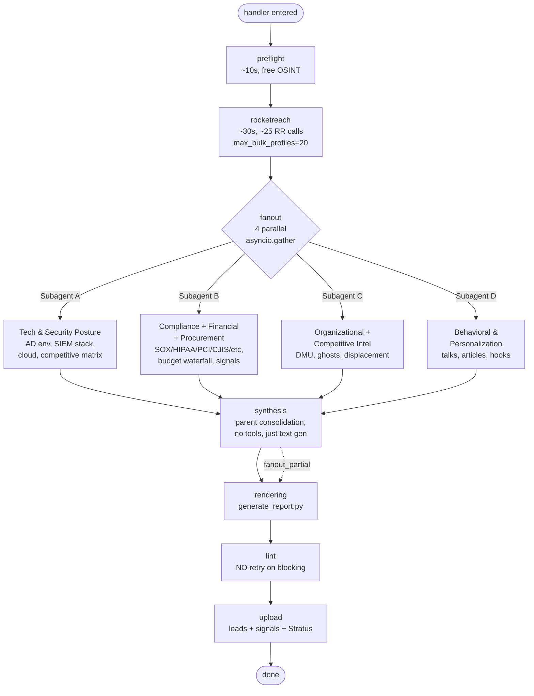

# 05 — ELISS Generator (Heavy)

The high-density variant of the dossier pipeline. Same contract as Light — same intake, same `dossier_requests` row, same polling UI — but fans out four parallel Anthropic subagent calls before a parent consolidation pass. Source: `functions/eliss-heavy-generator/main.py`.

## Why heavy exists

Light's single-call synthesis is fast and good. But for HOT-suspected prospects (named exec, high-value deal, complex compliance posture), one Claude call with 4 `web_search` uses can't dig deep enough on every layer at once. Heavy splits the research into four specialist subagents and lets each spend its own budget.

The cost is real: ~3× tokens, ~10× RR baseline (uses `max_bulk_profiles=20` vs Light's 10), wall time ~8-13 min instead of ~2-4. Use it sparingly. The UI gates heavy mode behind a 5-tap escape hatch (see `CreateDossierModal.tsx`).

## What's the same as Light

- Job Function contract (`(job_request, context)`, `request_id` param).
- 15-minute Job timeout ceiling.
- The intake validation, domain derivation, preflight, RocketReach baseline pass, error patching, store_lead upload, terminal status flags.
- Stratus filename pattern (`ELISS_<co>_<lead>_<date>.html`).

If you've read [04-eliss-generator-light.md](./04-eliss-generator-light.md), focus here on what's new: the `fanout` stage between `rocketreach` and `synthesis`, and the partial-status rules.

## Pipeline diagram



Solid arrows show the happy path; the dashed arrow indicates that if 1-3 subagents fail (`fanout_partial`), the pipeline continues with a degraded but still useful result.

## Stage-by-stage: where it differs from Light

### `fanout` (new stage)

Between RocketReach and synthesis, `lib/fanout.py::run_heavy_synthesis()` is invoked. Wall-time budget per subagent: 600 s. Each subagent gets:
- The full preflight JSON.
- The RR baseline (or `None` if `rr_full_miss`).
- A specialist system prompt from `lib/prompts.py`.
- The Anthropic `web_search` tool capped at `max_uses=10` per subagent (40 total across the fan-out).

The four subagent roles (from `/eliss` SKILL.md, ported as Python prompts):

**Subagent A — Tech & Security Posture (Layer 2)**
Maps the AD/Entra environment, SIEM/IAM/EDR/DLP stack, security hiring activity, cloud posture. Builds the Competitive Threat Matrix and Competitive Readiness Score. Returns: `technology.{ad_environment, security_stack, cloud_posture, digital_maturity, competitors_detected, competitive_threat_matrix, competitive_readiness_score, renewal_intelligence}`.

**Subagent B — Compliance + Financial + Procurement (Layers 3, 4, 4b)**
Three pictures in one subagent: regulatory frameworks (with audit findings + breach-notification obligations), IT spend + security budget estimation, and 4-8 of 16 procurement-cycle signals (RFP/RFI, budget amendments, audit deadlines, grant awards, contract expirations, M&A, earnings, etc.). Returns: `compliance[]`, `budget_analysis.{...}`, `signals.positive[]` with category tags.

**Subagent C — Organizational + Competitive Intelligence (Layers 5, 6)**
Maps the Decision-Making Unit (economic buyer, champion, technical evaluator, blocker) and ghost stakeholders. Applies the DMU Role Discipline (do not auto-assign sub-Director inbound contacts as champion). Extends Subagent A's Competitive Threat Matrix with displacement angles and renewal windows. Returns: `org_intelligence.{economic_buyer, technical_evaluator, champion, blocker, future_stakeholders, additional_stakeholders, local_autonomy, multi_thread_strategy}`.

**Subagent D — Behavioral & Personalization (Layer 7)**
Mines conference talks, published articles, LinkedIn posts, GitHub activity for personalization hooks. Returns: `lead.personalization_hooks[]`, first items of `rep_readiness_checklist[]`.

After all four return, the parent makes a final no-tools synthesis call to merge fragments, reconcile cross-layer observations (e.g., breach → post-breach Sentinel inference; new CISO → Timing +18 plus execution risk -3), compute scores, and produce `full_dossier_markdown` as a single unified narrative (not four sections back-to-back).

### Heartbeat callback

The fanout function takes an `on_stage` callback so the row's `MODIFIEDTIME` advances mid-fan-out — otherwise the frontend poller would treat a 6-minute synthesis stretch as "stuck." The callback is bound to `_patch_request(stage=...)` and fires when individual subagents complete.

### `lint` — NO retry

Heavy's lint stage **does not retry** on blocking hits. Rationale: the fanout already burned the token budget; a second pass risks pushing past the 15-minute Job cap, and the partial dossier is still useful. Any blocking hits surface as `status=partial` instead.

### Terminal status rules

```python
is_partial = bool(lint_result["hard_total"] > 0          # any HARD lint hit
                  or rr_degraded                           # OSINT-only dossier
                  or fanout_partial                        # ≥1 subagent failed
                  or _soft_hits_exceed_tolerance(           # SOFT hits > tier tolerance
                      lint_result, settings, tier, "heavy_lint_soft_tolerance"))
terminal_status = "partial" if is_partial else "succeeded"
```

Heavy reports `partial` more often than Light because of the third trigger (`fanout_partial` — any subagent failed). The frontend treats partial as "show the dossier with a warning banner"; the rep can still use it.

As of v1.1.0 the lint logic matches Light's HARD/SOFT model (see [04 §6](./04-eliss-generator-light.md) — `lib/depth_lint.py` is shared): HOT/WARM are strict (any empty cell warns), COLD/COOL tolerate up to `heavy_lint_soft_tolerance` empty cells (super-admin setting, default **4**), and `No sources cited` blocks at any tier.

## Memory and timing

Job-cap math from `main.py` docstring:

| Stage | Typical | Worst case |
| --- | --- | --- |
| preflight | ~10 s | ~30 s |
| rocketreach | ~30 s | ~60 s |
| fanout | ~5-8 min | ~10 min |
| synthesis | ~2 min | ~3 min |
| rendering + lint | ~10 s | ~30 s |
| upload | ~5 s | ~10 s |
| **Total** | **~8-10 min** | **~13 min** |

The 15-minute ceiling is intentional headroom over the worst case. If reliability falls short (>20% partial rate), the next architectural move is a 2-job pipeline — split the fan-out into one job and the consolidation into a second job, so each gets its own 15-min budget. That migration is not blocking; the current shape ships.

## Heavy-mode gating

Two checks must both pass to dispatch the heavy function:

1. **UI gate** — `CreateDossierModal.tsx` requires 5 modal-title taps within 3 seconds to enable the "Heavy" checkbox, which sets `_x: "h"` in the POST body.
2. **Server gate** — `featureFlags.js::isHeavyAllowed(userId, _x)` returns true only when `_x === "h"`. If you want to allowlist heavy by user, this is the single point of change.

If the server gate fails but `_x === "h"` was sent, the API silently downgrades to Light (no 4xx). The behavior is logged at the API level.

## When to use heavy vs light

| Scenario | Use |
| --- | --- |
| First touch on an unknown lead | Light |
| Named exec, complex compliance profile (HIPAA/CJIS/FedRAMP) | Heavy |
| Public-company target with multiple incumbents | Heavy |
| Refresh of a recently-generated dossier (<7 days) | Light (refresh) |
| `.gov` / `.edu` with likely RR coverage gap | Light (the OSINT banner is more legible on Light) |
| Demo or training | Light |

There is no automated heuristic — the rep decides. The 5-tap gate is deliberately friction.

## Cross-references

- The Light variant's full stage breakdown → [04-eliss-generator-light.md](./04-eliss-generator-light.md)
- The original `/eliss` skill's 4-subagent dispatch (this is the port target) → [09-eliss-skill-explained.md](./09-eliss-skill-explained.md)
- Job Pool memory ceiling → [08-catalyst-deployment.md](./08-catalyst-deployment.md)
- Why the heavy mode UI tap exists → [02-frontend-vite-react.md](./02-frontend-vite-react.md)
