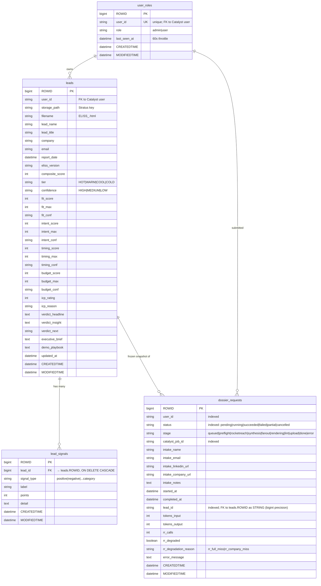

# 06 — Data Model

Four Catalyst Data Store tables drive the entire application. All four live in the SINGLE_DB schema attached to the project. ROWIDs are Catalyst bigint primary keys, allocated server-side.

## Tables at a glance

| Table | Table ID | Rows store | Created by |
| --- | --- | --- | --- |
| `leads` | `31210000000141001` | One row per generated dossier (the scored output). | `eliss-generator` / `eliss-heavy-generator` via `store_lead.py`. |
| `lead_signals` | `31210000000145001` | Buying signals attached to a lead (positive + negative). | `store_lead.py` at the same time it inserts the parent leads row. |
| `user_roles` | `31210000000143001` | App-level role per Catalyst user. | `loadRole` middleware (auto-creates a row on first authenticated request). |
| `dossier_requests` | `31210000000151002` | Job-status state machine for in-flight dossier generation. | `routes/dossiers.js` on POST `/dossiers/generate`. |

## Entity-relationship diagram



## `leads` (36 columns)

The system of record for everything a sales rep sees. Source: `functions/eliss-generator/lib/store_lead.py`.

**Identity and ownership:**
- `user_id` — Catalyst user ID of the requester. Required.
- `storage_path` — Stratus object key (e.g., `dossiers/<user_id>/ELISS_Acme_Smith_2026-05-22.html`).
- `filename` — Display filename. Used in the `Content-Disposition` of signed URLs.

**Prospect identity:**
- `lead_name`, `lead_title`, `company`, `email` — Extracted from the synthesis result. `email` is indexed for dedup queries.

**Metadata:**
- `report_date` — Date the dossier was generated (`YYYY-MM-DD`).
- `eliss_version` — Skill version stamp (e.g., `7.4.2`).

**Scoring (4 dimensions × 3 fields = 12 columns):**
- `composite_score` (int, **indexed**) — Sum of all four dimensions, max 100.
- `tier` (varchar, **indexed**) — One of `HOT`, `WARM`, `COOL`, `COLD`. Thresholds: HOT ≥ 75, WARM 50-74, COOL 30-49, COLD < 30.
- `confidence` — Overall confidence (lowest of the four dimension confidences).
- For each dimension `{fit, intent, timing, budget}`:
  - `<dim>_score` (int) — Raw points earned.
  - `<dim>_max` (int) — Maximum possible (25 / 25 / 30 / 20).
  - `<dim>_conf` (varchar) — `HIGH` | `MEDIUM` | `LOW`.
- `icp_rating` (int) — 1-5 star ICP match.
- `icp_reason` (varchar) — One-liner explaining the ICP rating.

**Verdict and narrative (text, ≤10K chars each):**
- `verdict_headline` — One-sentence headline shown above the score.
- `verdict_insight` — 2-3 sentence "what's interesting here".
- `verdict_next` — Single recommended next action.
- `executive_brief` — 3-5 sentence summary used on Tab 1.
- `demo_playbook` — JSON-encoded teaser for the rep (has `ad360_hook`, `log360_hook`, `has_playbook`).

The full conversational dossier (`full_dossier_markdown`) is **not** stored in this table — it lives in the rendered HTML in Stratus. The bridge is `storage_path` + `filename`.

**Audit columns:** `ROWID`, `CREATORID`, `CREATEDTIME`, `MODIFIEDTIME`, `updated_at`. Catalyst manages the first four; the application writes `updated_at`.

## `lead_signals` (9 columns)

One row per buying signal mined from the dossier. The relationship to `leads` is a hard foreign key with `ON DELETE CASCADE` — deleting a lead drops all its signals.

- `lead_id` (bigint, **FK**, indexed) — Parent lead's ROWID.
- `signal_type` (varchar, **indexed**) — Bucket: `positive`, `negative`, or a category tag like `compliance_deadline`, `security_hire`, `breach_incident`.
- `label` (varchar) — Human-readable signal name (e.g., "New CISO hire — 60 days").
- `points` (int) — Contribution to `composite_score`. Negative for disqualifiers.
- `detail` (text) — Evidence and reasoning (1-3 sentences with source URL).

The Tab 1 signal timeline reads from this table; sorting is by `CREATEDTIME` proxied through the signal's `age_days` field embedded in `detail` JSON.

## `user_roles` (7 columns)

Application-level role layered on top of Catalyst's project-user roles (which Catalyst calls "App Administrator" and "App User" — see [10-security-and-rbac.md](./10-security-and-rbac.md) for the disambiguation).

- `user_id` (varchar, **mandatory, UNIQUE**) — Catalyst user ID. The unique constraint is the dedup gate.
- `role` (varchar) — `admin` or `user`. Application-level only; does **not** automatically grant Catalyst console access.
- `last_seen_at` (datetime) — Updated by `loadRole` middleware, throttled to one write per 60 seconds per user to avoid hot-row contention.

**Self-heal rule:** if a Catalyst-authenticated request arrives with no matching `user_roles` row, the middleware inserts one with `role='user'`. App Administrators (per Catalyst's own console role) bypass this and get `role='admin'` only when explicitly set by another admin via `/admin/users`. See [10-security-and-rbac.md](./10-security-and-rbac.md) for the rationale.

## `dossier_requests` (22 columns)

The state machine for the async dossier-generation job. Updated by both the API function (on POST) and the Job Function (every stage boundary, as a heartbeat).

**Lifecycle:**
- `status` (**indexed**) — terminal states: `succeeded`, `failed`, `partial`, `cancelled`. In-flight: `pending`, `running`.
- `stage` — finer-grained sub-state within `running`: `queued → preflight → rocketreach → [fanout →] synthesis [→ synthesis_retry] → rendering → lint → upload → done`. On failure: `error`.
- `catalyst_job_id` (**indexed**) — The Job Function execution ID returned by `submitJob()`. Lets ops correlate this row with Catalyst's job log.

**Intake (copied from the POST body):**
- `intake_name`, `intake_email`, `intake_linkedin_url`, `intake_company_url`, `intake_notes`.

**Execution metrics:**
- `started_at` — Stamped when stage transitions to `preflight`.
- `completed_at` — Stamped on any terminal status.
- `tokens_input`, `tokens_output` — Anthropic usage from `synthesize()` (light) or the parent + fan-out (heavy).
- `rr_calls` — Total RocketReach endpoint hits.
- `rr_degraded` (bool) + `rr_degradation_reason` — Set to `true` when RocketReach has no firmographics for the org (`rr_full_miss`) or only partial data (`rr_company_miss`). Job continues — it's a coverage gap, not a failure. UI surfaces this as the "OSINT-only" banner.

**Failure:**
- `error_message` (text) — Up to 9999 chars, truncated. Surface verbatim in the UI's failed-job tooltip.

**Output linkage (the bigint gotcha):**
- `lead_id` — On `succeeded`/`partial`, points at the newly-inserted `leads.ROWID`. **Stored as a string**, not a bigint integer, because Catalyst's JSON serialization runs through `JS.Number` precision, and a 17-digit ROWID > 2^53 loses its last digit. Source: `eliss-generator/main.py:_run_pipeline` last patch (`lead_id=str(result["id"])`). See the Memory rule `feedback_catalyst_bigint_json_precision`.

## Critical invariants

### Regenerate always creates a NEW lead row

The frontend's "Regenerate" button POSTs to `/dossiers/generate` exactly like a fresh request. The Job Function never updates an existing `leads` row — it always `INSERT`s a new one. This is by design:

- The old URL keeps pointing at the frozen snapshot (the rep can still copy the previous score and outreach if a customer references it).
- The new row carries an independent `report_date` and `eliss_version` for auditability.
- Tab 1's lead-list view shows both side-by-side, ordered by `CREATEDTIME` desc.

Do **not** treat regenerate as an in-place update in any consumer. See the memory rule `project_lead_insight_hub_dossier_creates_new_lead`.

### Bigint serialization rule

Anywhere a `leads.ROWID` or `dossier_requests.ROWID` value crosses a JSON boundary as a **value** (not as a URL path segment), serialize it as a string. The Catalyst SDK handles ROWID-in-path identifiers transparently; the danger is FK columns and response bodies.

```python
# WRONG — silently off-by-one for 17-digit ROWIDs:
_patch_request(app, request_id, lead_id=int(result["id"]))

# CORRECT — survives JS-Number precision:
_patch_request(app, request_id, lead_id=str(result["id"]))
```

### ZCQL 300-row silent pagination cap

`SELECT *` returns at most 300 rows with no warning. Every query that could return >300 rows must paginate via `LIMIT offset, page`. See `functions/api/lib/db.js` for the canonical helper. Lead list queries are scoped per-user, so the cap is unlikely to bite for typical users — but list-all-users admin queries can hit it. Audit before assuming "I got everything."

### `dossier_requests` never deletes

Failed and cancelled rows are kept indefinitely so the analytics surfaces (`/stats`) can compute true failure rates. There is no cleanup job. If storage cost becomes a concern, design an archival job that moves rows older than 180 days to Stratus — do not `DELETE`.

## Cross-references

- The Express routes that read/write these tables → [03-api-function.md](./03-api-function.md)
- The job function that populates `leads` and `lead_signals` → [04-eliss-generator-light.md](./04-eliss-generator-light.md)
- How `user_roles.role='admin'` is enforced → [10-security-and-rbac.md](./10-security-and-rbac.md)
- Stratus signed-URL TTL and bucket layout → [07-integrations.md](./07-integrations.md)
