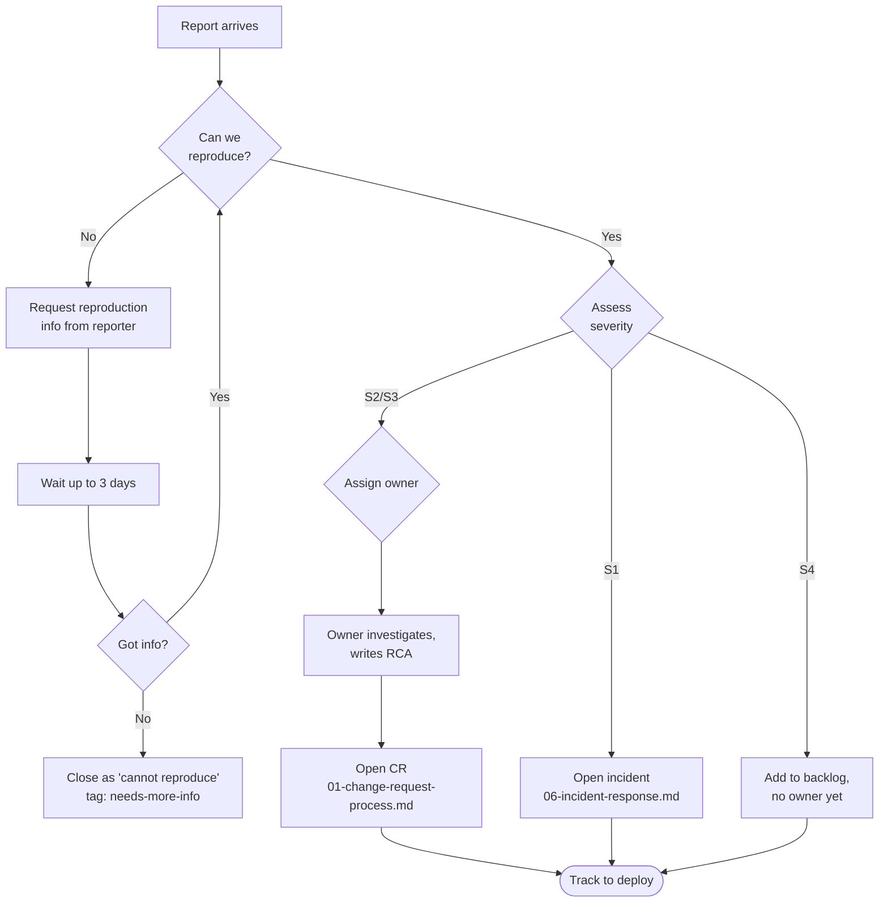

# 02 — Issue Triage

How reports (from users, ops, or QA) become tracked work. Optimized for "the right person sees the right thing at the right urgency."

## Severity matrix

| Severity | Definition | Response SLA |
| --- | --- | --- |
| **S1 — Outage** | Users cannot log in, cannot generate dossiers, or cannot view existing leads. Customer-blocking. | Acknowledge within 15 min. Mitigation underway within 1 hour. Update users until resolved. |
| **S2 — Degradation** | Feature is partially broken (e.g., heavy generator failing >20% of the time but light works; mobile layout broken on one route; admin user-list shows stale data). Workaround exists. | Acknowledge within 1 business hour. Fix in next deploy cycle (≤3 business days). |
| **S3 — Cosmetic / minor** | Visual glitch, typo, edge-case error message, slow query under specific load. No business impact. | Acknowledge within 1 business day. Fix when convenient. |
| **S4 — Feature request** | Not a defect — a missing capability. | Captured in the backlog; reviewed in periodic planning. |

If you cannot decide between two severities, pick the higher one — it's cheap to downgrade later.

## Triage workflow



## Reproduction template

Before assigning an issue, attempt to reproduce. The reporter's free-form description is rarely enough — capture the deterministic version:

```markdown
## Reproduction
1. Sign in as user `<email>` (App User role).
2. Navigate to `/leads`.
3. Click "Create Dossier".
4. Fill: name=Test, email=test@example.com.
5. Submit.
6. Observe: <what happens>.
7. Expected: <what should happen>.

## Environment
- Browser: Chrome 124 / Safari 17 / Firefox 125
- OS: Windows 11 / macOS / iOS
- Environment: dev / prod
- Date/time observed (with timezone): 2026-05-22T13:42+05:30
- `dossier_requests.ROWID` (if relevant): 31210000000200099
```

If you can't reproduce after 15 minutes of trying, ask the reporter for the missing context. Don't guess.

## Common categories and routing

| Symptom | Likely cause | Owner / Investigation entry point |
| --- | --- | --- |
| "I can't log in" | Catalyst Auth session issue, browser cookie blocked | API logs (`functions/api` → Logs), Catalyst Auth health |
| "My dossier is stuck at stage X" | Job Function timeout, RR rate limit, Anthropic 529 | `dossier_requests.error_message`, function logs |
| "Score seems too low" | Confidence cap or negative modifier applied | Inspect the dossier's `scoring.deal_execution_risks[]` and `scoring.negative_modifiers` |
| "RocketReach pills don't appear" | `rr_degraded=true` (coverage gap) or `RR_API_KEY` missing | Check the request row; verify env var via deploy log |
| "I see another user's data" | Authorization bug — escalate to S1 | Check `WHERE user_id` clauses in the offending route |
| "Mobile layout broken on route /X" | Tailwind / shadcn regression | Compare with `qa-audit-2026-05-15` baselines |
| "Admin panel doesn't show new user" | ZCQL pagination cap (300 rows) | Audit the admin route for missing pagination |

## When to open an incident vs a CR

- **Open an incident** (severity S1) if production is broken right now. Skip the CR process initially; remediate first.
- **Open a CR** (severity S2/S3) for anything else. The CR carries the change through review and deploy.

## RCA discipline

For every S1 and S2, write a short RCA (root-cause analysis) before merging the fix:

```markdown
## RCA — <issue title>

**What happened:** <one paragraph, plain English>
**Why it happened:** <root cause, not symptoms>
**Why it wasn't caught:** <gap in tests / monitoring / review>
**Fix:** <what changed>
**Preventive action:** <how we keep this class of bug from recurring>
```

Append the RCA to the closing comment of the issue. The point isn't blame — it's pattern-recognition for the team.

## Cross-references

- Change-request process for non-emergency fixes → [`01-change-request-process.md`](./01-change-request-process.md)
- Testing depth that should catch issues before reports → [`03-testing-strategy.md`](./03-testing-strategy.md)
- Incident response for S1s → [`06-incident-response.md`](./06-incident-response.md)
