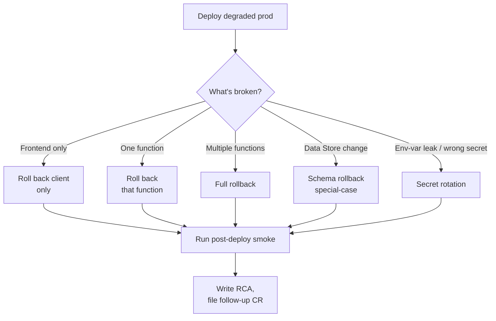

# 05 — Rollback Procedures

What to do when a deploy is degrading production right now. Speed matters; thoroughness comes after the bleeding stops.

## Decision tree



## Pre-condition: know what to roll back to

Catalyst does **not** keep deployment artifacts versioned with one-click revert. "Rolling back" means **redeploying a known-good previous build** from git. Therefore:

- Tag every production deploy: `git tag prod-v1.0.0` (or similar). Push tags.
- Note the commit SHA in the CR after promoting.
- If you don't know what was running before the bad deploy, **find the previous CR's noted commit SHA** before doing anything.

If neither tag nor SHA is recoverable, you don't have a clean rollback — you have a fix-forward situation. Document the gap in the RCA so the team adopts tagging discipline next sprint.

## Procedure A: Client-only rollback

If the SPA broke but the API is healthy.

```powershell
# 1. Stash any local changes
git stash

# 2. Check out the last good commit
git fetch --tags
git checkout <last-good-sha>     # e.g., prod-v1.0.0 tag

# 3. Rebuild the client
cd app
npm install
npm run build
cd ..

# 4. Redeploy client only
catalyst deploy --only client `
    -p 31210000000133001 `
    --org 50042142947 `
    --dc in `
    < NUL

# 5. Verify
Invoke-RestMethod "https://<prod-url>/server/api/health"
```

Wall time: ~5 minutes.

## Procedure B: Single-function rollback

If one function (e.g., `api`) is failing and the SPA + other functions are fine.

```powershell
git checkout <last-good-sha>

catalyst deploy --only functions:api `
    -p 31210000000133001 `
    --org 50042142947 `
    --dc in `
    < NUL
```

Replace `:api` with `:eliss-generator` or `:eliss-heavy-generator` for the Python functions. Wall time: ~5-10 minutes (Python functions slower because of the local dependency resolve).

## Procedure C: Full rollback

If multiple components are degraded or you can't isolate which.

```powershell
git checkout <last-good-sha>

cd app; npm install; npm run build; cd ..

catalyst deploy `
    -p 31210000000133001 `
    --org 50042142947 `
    --dc in `
    < NUL
```

Wall time: ~10-15 minutes.

## Procedure D: Data Store schema rollback

This is the riskiest case. Catalyst's Data Store allows column **additions** but not in-place drops or type changes. To "roll back" a schema:

- **Added a column that's now wrong:**
  - If the column has no data yet, leave it. The schema delta is harmless.
  - If the column has wrong data, redeploy the function code that wrote it (Procedure B). Don't drop the column.
- **Dropped a column you needed:**
  - Recreate the column in the Catalyst Console (Application → Data Store → table → Add Column).
  - Backfill data from logs or backups (Catalyst's automatic backups, if enabled, are the only source).
- **Renamed a column:**
  - Add the old name back as a new column.
  - Run a one-time `UPDATE` from the new name to the old name (via console SQL or a one-off function).

**Never `DELETE FROM` rows as a rollback.** Catalyst has limited transactional guarantees; a partial delete leaves a worse state than the bad deploy.

If a schema change broke production and the table has customer data, **open an S1 incident immediately** and involve the project owner before touching the data.

## Procedure E: Secret rotation rollback

If a deploy leaked or overwrote a secret incorrectly (e.g., `ANTHROPIC_API_KEY` got replaced with the dev key in prod):

1. **Generate a new key** at the vendor (Anthropic Console, RocketReach dashboard).
2. **Update `catalyst-config.json`** for the affected function with the new key.
3. **Redeploy the function only** (Procedure B):
   ```powershell
   catalyst deploy --only functions:<fn-name> `
       -p 31210000000133001 `
       --org 50042142947 `
       --dc in `
       < NUL
   ```
4. **Revoke the old key** at the vendor — only after the deploy succeeds and `/health` confirms the function picked up the new env.

See [`07-credentials-and-rotation.md`](./07-credentials-and-rotation.md) for the full rotation cadence.

## Job Pool memory rollback

If you bumped Job Pool memory and it caused a billing or behavioral surprise:

1. **Catalyst Console → Job Scheduling → Job Pools → `elissgenpool` → Edit.**
2. **Restore the previous memory value** (label format like `1.5GB`, not raw `1024` — per memory rule `feedback_catalyst_jobpool_creation_gotchas`).
3. **Hard-refresh the console** (a stale cache can show old values).
4. **Smoke-test a heavy-dossier** to confirm it still fits under the new ceiling.

Job Pool name changes are **not reversible** (the name is part of the URL); only memory and timeout are editable.

## After the rollback

Within 24 hours of stabilization:

- [ ] **Write the RCA** (see [`02-issue-triage.md`](./02-issue-triage.md)).
- [ ] **File the follow-up CR** with the actual fix. Reference the rolled-back commit SHA.
- [ ] **Add a regression test** that would have caught the original bug.
- [ ] **Update this document** if the rollback exposed a new failure mode or trick worth recording.
- [ ] **Update the deploy tag policy** if a missing tag made the rollback harder than it should have been.

## What we don't have at v1.0.0

- Automated rollback on health-check failure. Catalyst doesn't ship blue-green automatically; a bad deploy is live the moment the CLI says SUCCESS.
- Database point-in-time restore. If the data is corrupted, ad-hoc UPDATEs are the only path. Backups are Catalyst's automated daily snapshots (Console → Data Store → table → Backups).
- Function image versioning. Catalyst stores only "current." The redeploy-an-old-commit pattern is the only way back.

These are accepted limitations at v1.0.0. If the team grows to require any of them, document the upgrade in a new CR.

## Cross-references

- The deploy commands rollback reuses → [`04-deployment-runbook.md`](./04-deployment-runbook.md)
- RCA structure → [`02-issue-triage.md`](./02-issue-triage.md)
- Incident response (rollback may be one mitigation step) → [`06-incident-response.md`](./06-incident-response.md)
