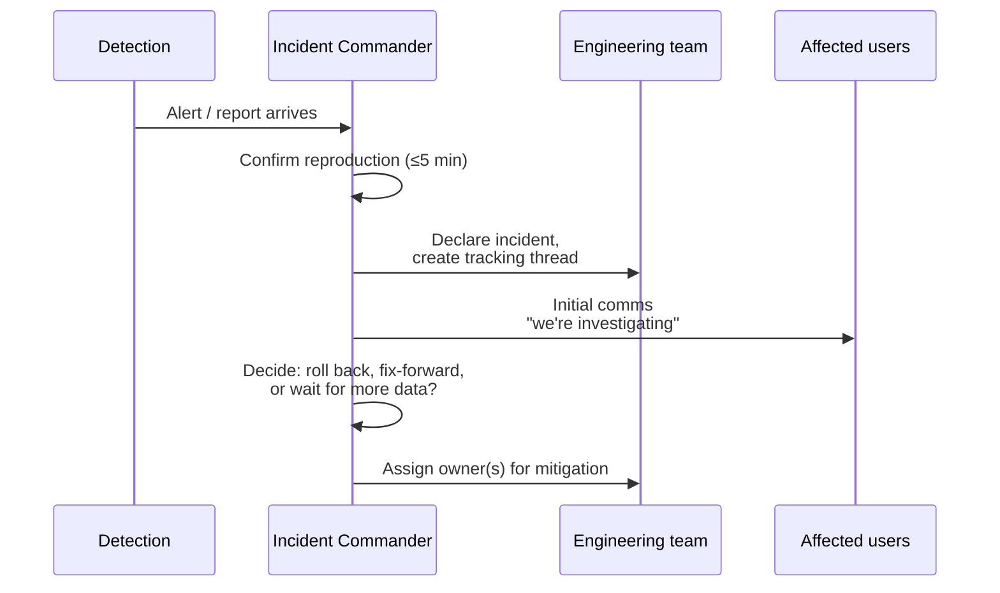

# 06 — Incident Response

What happens when production is broken right now. Optimized for fast mitigation, clear communication, and post-incident learning.

## What is an incident?

An incident is any S1 (per [`02-issue-triage.md`](./02-issue-triage.md)) — production is degraded for real users:

- Authentication broken for all users.
- Dossier generation failing >50% of attempts for >15 min.
- Customer data visible to the wrong user.
- Secret exposure (key leaked to logs, public bucket).
- App entirely unreachable.

S2 issues do **not** trigger incident response. They go through the regular triage and CR flow.

## Incident command chain

For each incident, exactly one person is **Incident Commander (IC)** for the duration. The IC:
- Decides mitigations.
- Coordinates communication.
- Pulls in other engineers as needed.

The IC defaults to the on-call. If no formal on-call rotation is set, it's the person who first notices, until they hand off explicitly.

## The first 15 minutes



### Step 1 — Confirm

Reproduce the symptom yourself before declaring. Hitting the dev URL doesn't confirm a prod incident; reproduce in the affected environment. If you can't reproduce in 5 minutes, the symptom may be flaky — treat as S2 unless evidence mounts.

### Step 2 — Declare

Open a tracking thread (Slack channel, GitHub issue, whatever the team uses). Title format: `INCIDENT: <short description> — <YYYY-MM-DD>`. First message includes:
- Symptom (from the user's perspective).
- When detected (timestamp + how).
- Initial reproduction.
- Who's IC.

### Step 3 — Communicate to users

For customer-impacting incidents, the IC posts an initial user-facing message. Template:

```
We're aware of an issue affecting <feature>. We're investigating and will update within 30 minutes.

Last update: <YYYY-MM-DD HH:MM IST>
```

Updates every 30 minutes until resolved. The message tone is **honest and brief** — no speculation, no blame, no jargon.

### Step 4 — Decide the mitigation path

Three options:

| Path | When to choose | First action |
| --- | --- | --- |
| **Roll back** | The bad deploy was recent; previous version is known good | Procedure C in [`05-rollback-procedures.md`](./05-rollback-procedures.md) |
| **Fix forward** | The bug exists in all recent versions, or rollback would lose important work | Open emergency CR, develop hotfix |
| **Wait** | A vendor outage (Anthropic, Catalyst, RocketReach) — nothing we can do directly | Set status to "monitoring vendor," update users |

When in doubt, **roll back first**. It's the fastest known-stable path. Fix forward after the bleeding stops.

## Mitigation playbooks (by symptom)

### "Nobody can log in"
- Check Catalyst Auth status: Catalyst Console → Authentication → Health.
- Check `functions/api` logs for 401 spikes.
- Verify the session cookie domain matches the SPA origin (rare regression but possible after Catalyst project changes).
- Mitigation: usually a Catalyst-side issue. Open a Catalyst support ticket if confirmed.

### "Dossiers failing"
- Check `dossier_requests` for recent rows: query `SELECT status, stage, error_message, COUNT(*) FROM dossier_requests WHERE CREATEDTIME > <1 hour ago> GROUP BY status, stage, error_message`.
- Common patterns:
  - All `error_message` say "RocketReach rate-limited" → vendor quota hit. Wait or contact RR.
  - All "synthesis failed: ... 529" → Anthropic overloaded. Wait or switch model.
  - All "RR_API_KEY not set" → secret got wiped by a recent deploy. Restore from `catalyst-config.json` source-of-truth and redeploy.
  - Stuck at `queued` → Job Pool full or function code regressed pre-stage-1. Check function logs.

### "Customer sees another user's lead"
- **Highest severity.** Treat as security incident.
- Immediately disable the offending route by deploying a 503 response (`res.status(503).send("temporarily down")`). Buys time for investigation.
- Inspect route's `WHERE user_id =` clause for the bug.
- After fixing: audit the table for cross-contamination (find rows where `user_id` doesn't match the actual owner). Likely requires the project owner's involvement.

### "Secret exposed"
- Rotate the secret immediately (Procedure E in [`05-rollback-procedures.md`](./05-rollback-procedures.md)).
- Search git history for the exposure point. If the secret was committed: rotate, then `git filter-repo` (carefully) to remove. The exposure window is "everything since the commit landed" — assume the worst.
- For Catalyst Function logs: the IC has no good way to scrub them. Log entries are append-only.

### "Catalyst console down or slow"
- Check https://status.zoho.com/ for a known Catalyst outage.
- If listed: communicate to users, wait, no fix possible.
- If not listed: open a Catalyst support ticket (Console → Help → Contact Support) with the project ID.

## When to escalate

Escalate to the project owner (the person who pays the Catalyst bill / owns the data) when:
- The incident affects production for >2 hours without a clear mitigation path.
- Customer data may have been exposed.
- A secret was leaked.
- The root cause is unknown but the symptom keeps recurring.

The escalation channel is direct — the IC pings the owner with a one-paragraph summary and "I need your input on X."

## Post-incident

Within 48 hours of resolution:

### 1. Postmortem

Use this template (commit to `docs/postmortems/YYYY-MM-DD-<slug>.md`):

```markdown
# Postmortem — <title>

**Date:** YYYY-MM-DD
**Severity:** S1
**Duration:** <start> → <end> (<X> minutes)
**Incident Commander:** @<handle>

## Timeline
- HH:MM — Detection: <how>
- HH:MM — Declared incident
- HH:MM — Mitigation deployed
- HH:MM — Recovery confirmed
- HH:MM — All-clear comms

## Impact
- How many users affected
- What couldn't they do
- Did any data get corrupted / lost / exposed

## Root cause
What actually happened, in plain English.

## Why we didn't catch it earlier
Specific gap in testing, monitoring, or review.

## Resolution
The mitigation that stopped the bleeding (may differ from the permanent fix).

## Permanent fix
The CR that locks the door for good.

## Action items
- [ ] Specific, owned, dated. e.g.: "@alice: add integration test for cross-user lead access by 2026-06-01"
- [ ] No vague "we should be better at X" items.
```

### 2. Action items tracking

Every action item from the postmortem becomes an issue with an owner and a deadline. The team reviews open action items in the next planning cycle.

### 3. Comms close-out

Final user-facing message:

```
The <feature> issue from <date> has been resolved. We've identified the cause and are taking steps to prevent recurrence. Thank you for your patience.
```

## What we don't have yet

- **Alerting.** There is no automated monitoring at v1.0.0. Incidents are detected by user reports. Adding a Catalyst APM-based alert (or a simple cron-driven `/health` probe) is a high-value backlog item.
- **Status page.** No public status URL. Comms happen via the team's communication channel.
- **On-call rotation.** Whoever sees the alert first is IC. A formal rotation should follow customer adoption.

These are accepted gaps. Document them in any postmortem where they slowed the response.

## Cross-references

- Rollback procedures the IC may invoke → [`05-rollback-procedures.md`](./05-rollback-procedures.md)
- Secret rotation procedure → [`07-credentials-and-rotation.md`](./07-credentials-and-rotation.md)
- Severity definitions and triage workflow → [`02-issue-triage.md`](./02-issue-triage.md)
- Where the access logs live → [`../architecture/10-security-and-rbac.md`](../architecture/10-security-and-rbac.md)
